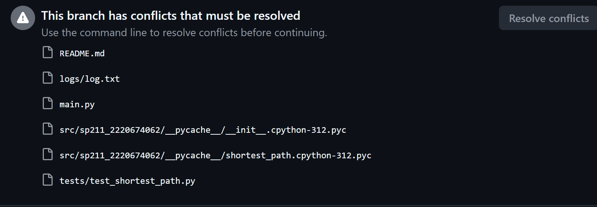
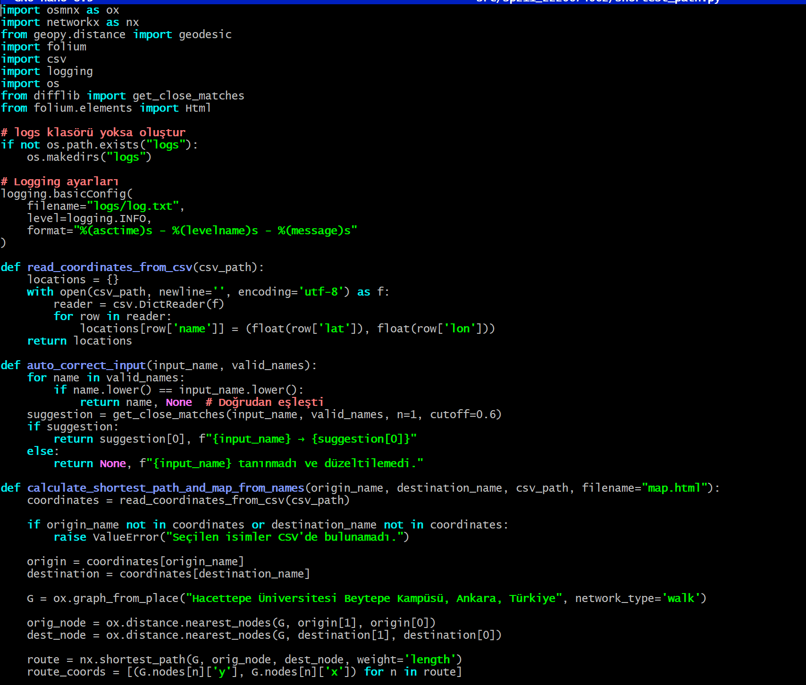
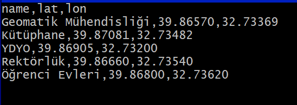
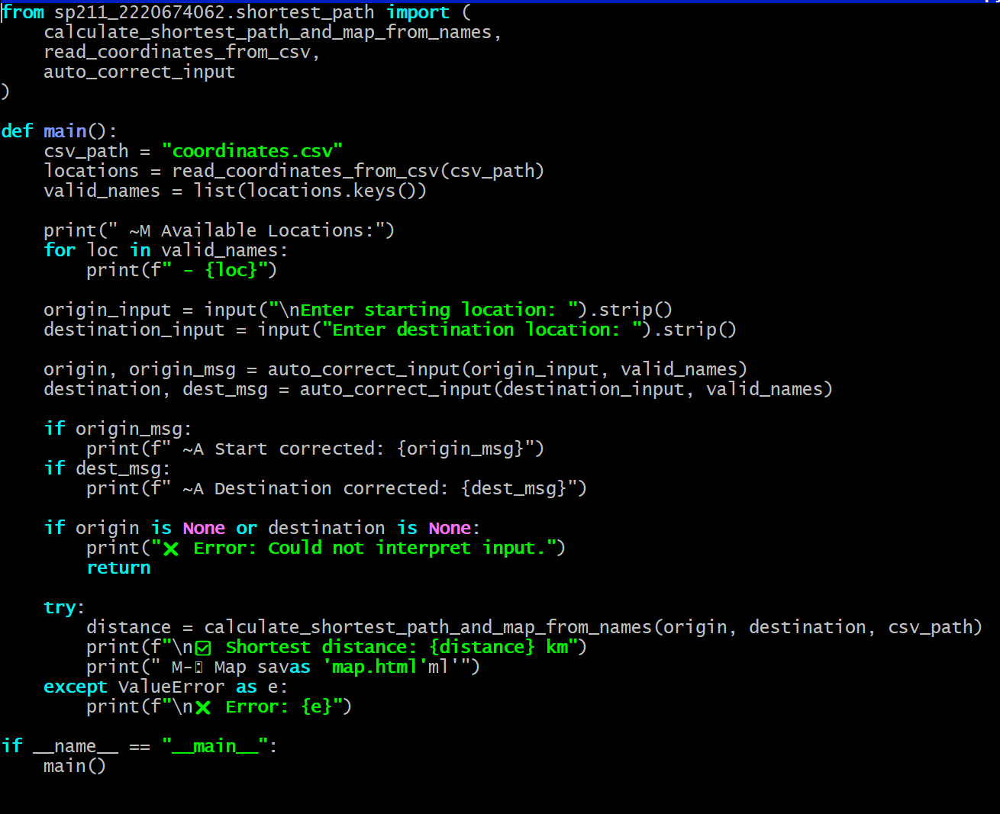
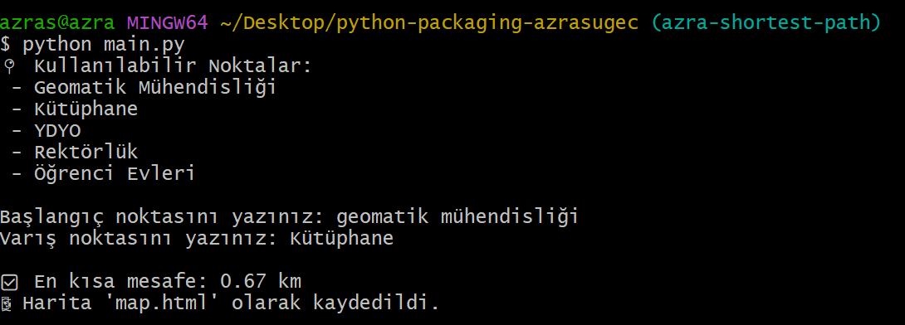
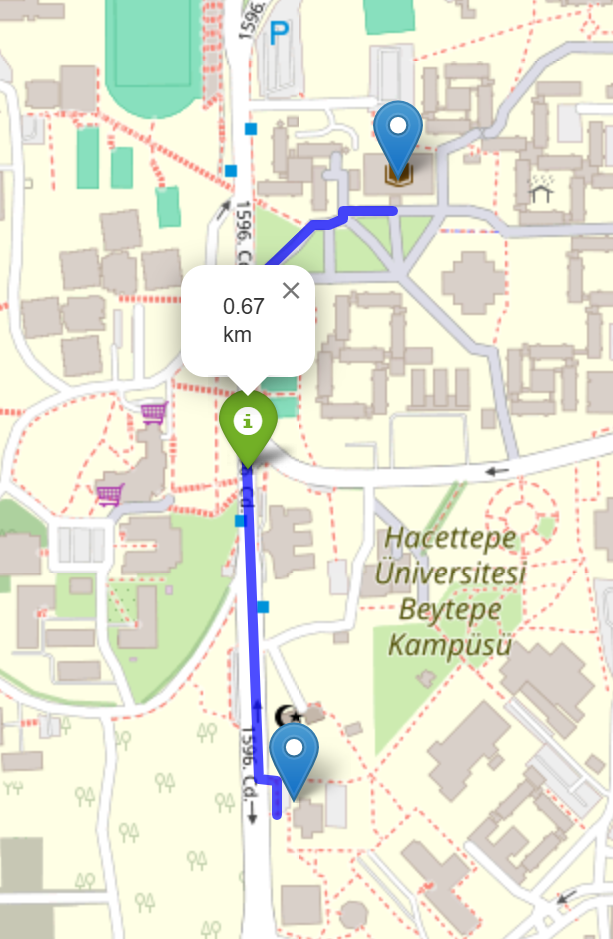
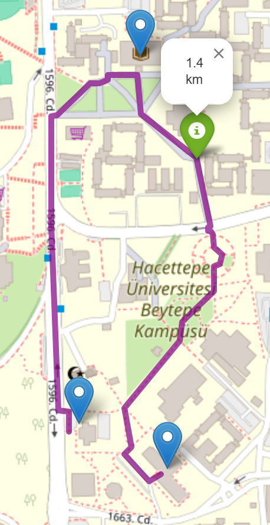
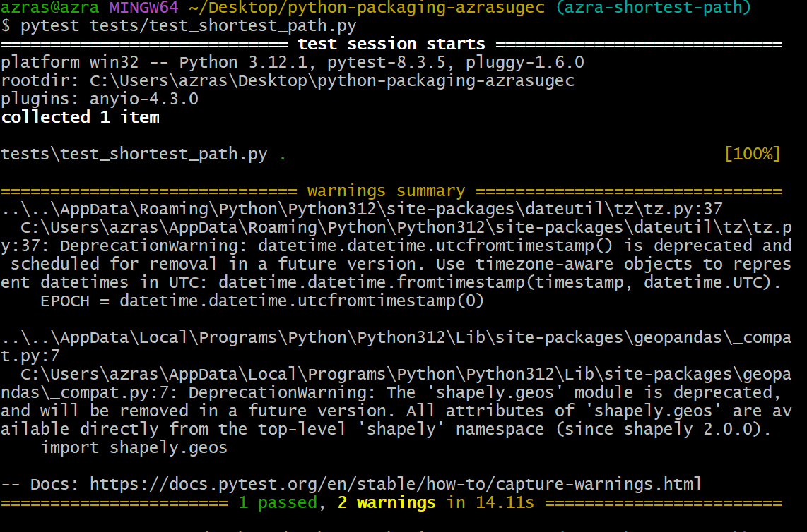
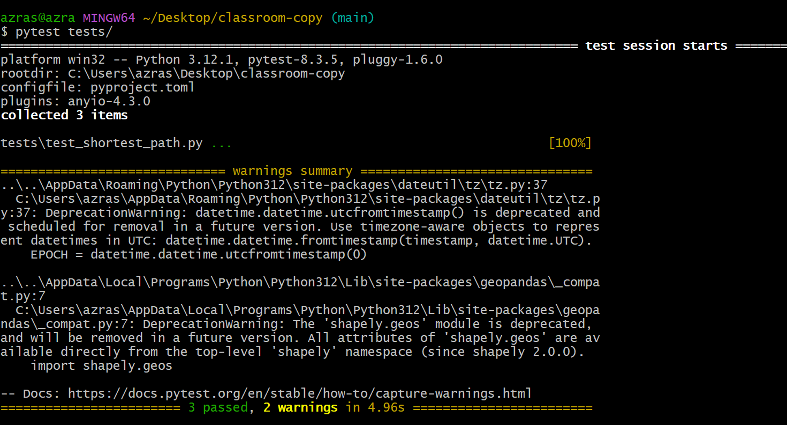

# 📦 Shortest Path Project – Azra Sugeç 


This Python package calculates the shortest walking route between two selected locations
based on OpenStreetMap (OSM) data.

The project is designed around Hacettepe University’s Beytepe Campus as a sample area,
but it is flexible enough to be used with any CSV file that includes location names and coordinates.


## ⚠️ IMPORTANT NOTICE ⚠️

I would like to inform you that I encountered some difficulties while completing this assignment,  
and I am aware that there may be certain mistakes in my submission.

Although I repeatedly deleted my local project files, some components were not fully removed from GitHub Classroom.  
This led to file conflicts and caused the project structure to become overly complex and layered.

I have made my best effort to resolve these issues, and I continued development using a clean backup.  
Still, I am not entirely confident that everything is perfectly correct.

Thank you for your understanding.

> The screenshot below shows the error I encountered during the conflict:

### 💡 Key Features

- 📍 Reads custom location data from a `coordinates.csv` file
- ✨ Provides intelligent input correction (e.g., `küütüphane` → `Kütüphane`)
- 🗺️ Generates an interactive route map as a `.html` file
- 🔗 Creates a clickable OpenStreetMap route link
- 📝 Automatically logs activity to `logs/log.txt`
- 🧪 Includes unit testing with `pytest`
- 📦 Fully packaged and published to [TestPyPI](https://test.pypi.org/project/sp211-2220674062/)
- ❗New Features Added 

-------
> ⚠️ **Update Notice – 8 June 2025**
>
> This repository was updated to fulfill the second phase of the final assignment.
> Below is a summary of the key updates and improvements made in this version:

| Feature / Update                    | Description                                                                 |
|------------------------------------|-----------------------------------------------------------------------------|
| ✅ `get_route_summary()`           | Calculates distance, number of steps, and estimated walking time            |
| ✅ `calculate_multi_stop_route()`  | Supports routes with multiple stops (A → B → C)                             |
| ✅ Unit tests added                | Tests verify core functions like route and map generation (`pytest`)        |
| ✅ CI/CD pipeline added            | GitHub Actions runs tests on every push                                     |
| ✅ `requirements.txt` created      | Ensures correct installation of all dependencies including `scikit-learn`   |
| ✅ Error-resilient input handling  | Uses `difflib` for AI-like fuzzy input correction                           |

> 😊 Below, you will find a step-by-step breakdown of the project structure and how each feature was developed and integrated.


------

## 🪄 Step 1 – Creating and Switching to a New Branch

To follow clean versioning and development practices, a new branch named `azra-shortest-path` was created and activated using the following command:

```bash
git checkout -b azra-shortest-path
```


 
-------
## Step 2 – Writing the Core Algorithm in `shortest_path.py`

The core logic of the project is implemented inside `src/sp211_2220674062/shortest_path.py`.  
It contains all the key components required to read location data, apply intelligent input correction, build the walking network using OSM, and calculate the shortest path.

### ✨ Key Functions:

- `read_coordinates_from_csv()`  
  Reads the coordinates of available locations from a CSV file.

- `auto_correct_input()`  
  Automatically corrects user input by matching it with the closest known location name.

- `calculate_shortest_path_and_map_from_names()`  
  Uses OSMnx to generate the walking network graph for the Beytepe Campus, and NetworkX to calculate the shortest route using Dijkstra’s algorithm.  
  It then visualizes the result with Folium and saves it as an interactive HTML map.

> Logs are saved automatically under the `logs/log.txt` file if the folder doesn't exist.

>❗**Recently Added Features** `get_route_summary()`  
  Calculates distance, number of steps, and estimated walking time.

>❗**Recently Added Features** `calculate_multi_stop_route([...])`  
  Computes routes that pass through multiple waypoints in order.




-------

## 📍 Step 3 – Preparing the `coordinates.csv` File

In order for the shortest path algorithm to work, it must read real geographic coordinates from a CSV file.  
The file `coordinates.csv` contains the name, latitude, and longitude of each location on Hacettepe University's Beytepe Campus.

This file is used by the function `read_coordinates_from_csv()` to build the location dictionary used in all route calculations.

### 🗂️ Sample Format:

```csv
name,lat,lon
Geomatik Mühendisliği,39.86570,32.73369
Kütüphane,39.87081,32.73482
YDYO,39.86905,32.73200
Rektörlük,39.86660,32.73540
Öğrenci Evleri,39.86800,32.73620
```


----------

## 📦 Step 4 – Uploading the Package to TestPyPI

After the development and packaging steps were completed, the Python package was uploaded to [TestPyPI](https://test.pypi.org/project/sp211-2220674062/).

This allows users to install the package directly via pip and test its functionality without publishing to the main PyPI index.

### 🧪 Installation Command:

```bash
pip install -i https://test.pypi.org/simple/ sp211-2220674062
```


---------
## 👩‍💻 Step 5 – Interactive CLI with `main.py`

To make the project usable from the command line, a simple interface was created using a `main.py` script.

This script prompts the user to enter a starting and destination location.  
It uses the intelligent correction system to validate inputs and calls the main shortest path calculation function.

The result is printed in the terminal and the route is saved as an interactive `map.html` file.

### 🔹 What it does:

- Lists available location names
- Accepts user input
- Corrects spelling if needed
- Calculates the shortest route using Dijkstra algorithm
- Displays distance and saves map



>❗**Recently Added Features** 

- The `main.py` script was updated to support multiple destination inputs (e.g., A → B → C),  
- and now calculates the total route distance for multi-stop paths.  
- The result is displayed in the terminal and saved as `multi_map.html`.


---------

## 📏 Step 6 – User Input and Route Generation

Once the user provides valid input through the CLI, the program uses the OSM-based walking network to compute the shortest route between the selected locations.

The distance is displayed in the terminal, and the route is visualized and saved as an interactive `map.html` file using the Folium library.

### 🖋️ Sample Interaction:

- User selects "Geomatik Mühendisliği" as the origin
- User selects "Kütüphane" as the destination
- Output: Distance and confirmation message

```bash
✅ En kısa mesafe: 0.67 km  
🗺️ Harita 'map.html' olarak kaydedildi.
```



-----------
## 🗺️ Step 7 – HTML Map Output with Route Visualization

After the shortest route is calculated, the project generates an interactive HTML map using the `folium` library.

The map shows:
- 📍 The origin and destination with markers
- 🛣️ The shortest path highlighted in blue
- ℹ️ A distance label in the center

The file is automatically saved as `map.html` and can be opened in any web browser.



>❗**Recently Added Features** 

> The generated map now supports multi-stop routes.  
> In the example below, the walking path goes through three locations in order, and the total distance is shown on the map as well.  
> Each stop is marked with a blue pin, while the total distance is displayed at the midpoint with a green info marker.



-----------
## ✅ Step 8 – Unit Testing with Pytest

The package includes unit tests to verify key functionalities.  
For example, a test case checks whether the shortest distance calculation returns a valid value and that the map is properly created.

### 🧪 Test Script: `test_shortest_path.py`

- Confirms that a route is calculated between predefined points
- Ensures the resulting `map.html` file exists
- Automatically removes the test map after the test

```bash
pytest tests/test_shortest_path.py
```



>❗**Recently Added Features** These features were verified using `pytest`, and continuous integration was set up via **GitHub Actions**.  
> The test suite is automatically triggered on each commit to ensure functionality.


---------

## 🗂️ Step 9 – Logging System (`logs/log.txt`)

Every successful shortest path operation is automatically logged into the `logs/log.txt` file.  
This provides a useful audit trail for usage and debugging.

Each log entry includes:
- 📍 Origin and destination names
- 📏 Calculated distance
- 📁 Saved map file name
- 🕒 Timestamp of the operation

Example log format:

```text
2024-06-01 21:35:12 - INFO - Geomatik Mühendisliği → Kütüphane | Mesafe: 0.67 km | Harita: map.html
```


---------


## 📚 Step 10 – Sphinx Documentation with Wagtail Theme

To provide clear and accessible documentation, the project uses [Sphinx](https://www.sphinx-doc.org/) for static site generation.

The documentation includes:
- 📖 Introduction and description
- 💾 Installation guide
- ⚙️ Usage example
- 📍 Route visualizations

### 🌈 Theme:

This project uses the custom **Wagtail Theme** from the [Sphinx Themes Gallery](https://sphinx-themes.org/) to enhance readability and user experience.

> The documentation is automatically generated from `docs/` and deployed using GitHub Pages.


----------

## 📦 Used Python Libraries

Below is a summary of the external Python libraries used in this project and their respective purposes:

| Library       | Purpose                                                                 |
|---------------|-------------------------------------------------------------------------|
| **osmnx**     | To generate a walking network graph from OpenStreetMap data             |
| **networkx**  | To calculate the shortest path using Dijkstra’s algorithm               |
| **geopy**     | To measure geographic distance (in kilometers) between coordinates      |
| **folium**    | To generate an interactive HTML map with markers and route polylines    |
| **csv**       | To read user-defined location data from `coordinates.csv`               |
| **logging**   | To log each operation and output into `logs/log.txt`                    |
| **difflib**   | To correct user input with fuzzy matching (AI-like suggestion system)   |
| **pytest**    | To write and run unit tests that verify core functionalities            |
| **Sphinx**    | To generate structured documentation and host it with Wagtail Theme     |
| **scikit-learn** | To support nearest node search via BallTree in OSM-based unprojected graphs |
| **twine**        | To securely upload the Python package to TestPyPI                           |

-----------


## 🤖 How AI is Used

While this project does not use deep learning or machine learning models, it leverages **AI-like behavior** in two key ways:

---

### 1️⃣ Smart Input Correction System

The project uses `difflib.get_close_matches()` to automatically correct user input by comparing it with valid location names.  
This fuzzy matching mechanism prevents errors and enhances the user experience by mimicking human-like interpretation.

**Example:**

```text
User input: "küütüphane"
→ Corrected to: "Kütüphane"
```
----------
## 🔁 Step 11 – CI/CD with GitHub Actions

A continuous integration pipeline was configured using GitHub Actions.

-  Automatically installs dependencies from `requirements.txt`
-  Runs `pytest` on each push
-  Ensures code reliability with every update


## ✅ Conclusion

This project demonstrates how to build a fully functional and user-friendly Python package for shortest path analysis using real-world geospatial data.

It incorporates:

- 📍 Coordinate-based location selection  
- 🤖 Intelligent input correction (AI-like behavior)  
- 🧪 Unit testing and logging  
- 🗺️ Interactive HTML map visualization  
- 📚 Full documentation using Sphinx and Wagtail Theme  
- 📦 Published package on TestPyPI  
- 🔄 Extended support for multi-stop route planning and route summaries

Throughout the development process, attention was given to both functionality and usability.  
The result is a clean, documented, tested, and reusable Python package that can be customized with any location-based dataset.

> This project has helped strengthen skills in Python programming, modular design, package publishing,  
> automated testing, and AI-assisted development.

Thank you for reviewing this work!

